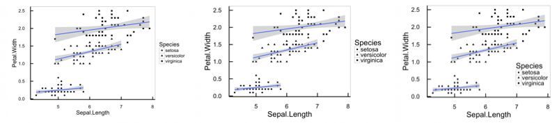
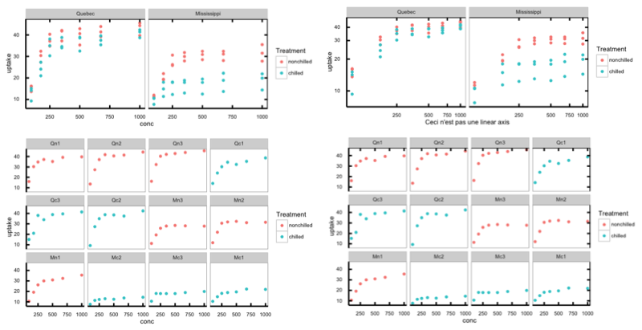

# DeLuciatoR

A few tools to help the DeLucia lab make R plots look the way Evan wants them to look. Improvements from DeLucians are encouraged, improvements from anyone else are welcome but subject to judgement calls on whether they fit the lab aesthetic.

Basic goals of "look the way Evan wants", not all of which are implemented yet:

- [ ] All text and markings large enough to be *easily* readable when reduced to a tiny subfigure or crammed into a low-rez powerpoint slide. Mostly implemented, needs your feedback on which sizes need refinement.
- [x] 1.33:1 aspect ratio (Y axis 3/4 as tall as X axis is long).
- [x] Axis ticks facing inward.
- [x] Axis ticks on all four sides. Requires package 'ggplotTicks' (see below).
- [x] Y-axis numbers set horizontally.
- [ ] Colors, if any, should be interpretable by dichromats and by those who printed the paper in black and white. Not yet implemented, but the [viridis](https://github.com/sjmgarnier/viridis) package may help.
- [ ] It should be as easy as possible to rescale one plot to look good at any size you need it. Partly implemented: Most axis and legend elements scale nicely, but you still need to manually  adjust the size of plotting symbols and annotation text.

The package currently provides:

* One ggplot2 theme, mostly optimized for X-Y plots but probably suitable for most scatter/line plots and a good starting point for most bar/box/density plots.
* Some functions to save correctly-shaped images of fixed-aspect-ratio plots: Specify a maximum height and width, get the biggest image that fits inside them. Compare this to the default pdf and png graphics functions, which make you specify an exact height & width (tedious to calculate for multipanel plots) and add oodles of whitespace if you get the ratio wrong.

Please help me add to the toolbox! Let's add more shortcuts for common ggplot actions, and some themes for Lattice plots... and for plain old base graphics too!


## Installation

The easy way, in an R session:

```{r}
install.packages("devtools")
devtools::install_github("infotroph/DeLuciatoR")
library("DeLuciatoR")
```

The hard way, in a terminal window (you only need to do this if you want to make your own changes to the package):

```{r}
git clone https://github.com/infotroph/DeLuciatoR.git
# Edit any files you like here
R CMD build DeLuciatoR
R CMD check DeLuciator_0.1.0.tar.gz
# If R complains, go back and fix any errors here
R CMD install DeLuciator_0.1.0.tar.gz
```


## Setting the theme

Use `theme_ggEHD` the same way you use the built-in ggplot themes: Add it to the original plotting call, or save the object and modify the theme later.

```{r}
p = (ggplot(iris, aes(Sepal.Length, Petal.Width, shape=Species))
	+ geom_point(size=2)
	+ geom_smooth(method="lm")
	+theme_ggEHD())

plot(p) # "...hmm, that text is too small..."
plot(p + theme_ggEHD(base_size=24)) # "...better, but the legend needs to move..."
p = p + theme_ggEHD(base_size=24) + theme(legend.position=c(0.85, 0.25)) # "...Aaah, good."
```



## Putting ticks on all sides

The ggplot2 package provides no built-in way to put ticks on all sides of the plot. To get around this, I wrote [an R package](https://github.com/infotroph/ggplotTicks) that mirrors the axes after the rest of the plot is constructed. I will eventually make this package use it automatically; for now, grab it from GitHub and wrap your plots in a call to `mirror_ticks`:

```{r}
install_github("infotroph/ggplotTicks")
library("ggplotTicks")

p_two = (ggplot(CO2, aes(conc, uptake, color=Treatment))
	+ geom_point()
	+ facet_wrap(~Type)
	+ theme_ggEHD())

p_four = mirror_ticks(p_two)
```
`p_four` is now a modified ggplot, with plot ticks on all four sides. It behaves *almost* exactly like a ggplot, *except* that adding or removing facets will remove the mirroring:

```{r}
# has ticks on all sides
plot(p_four)

# has ticks on all sides
plot(p_four
	+ coord_trans(x="log", y="log")
	+ xlab("Ceci n'est pas une linear axis"))

# loses mirroring; identical to p_two + facet_wrap(~)
plot(p_four + facet_wrap(~Plant))

# has ticks on all sides
plot(mirror_ticks(p_four + facet_wrap(~Plant)))
```



See the `ggplotTicks` documentation for more details.


## Image size calculations

Once you have a plot you like, save it. DeLuciatoR makes that easy:

```{r}
ggsave_fitmax(
	filename="iris_plot.pdf",
	plot=p,
	maxwidth=6.5,
	maxheight=9)
```

Why is this better than `ggsave` or `pdf(...); plot(...); dev.off()` or `File > Save As...`? In short, because `ggsave_fitmax` is *simple*, *consistent* no matter whether called from a script or an interactive session, and *repeatable*.

When you save one plot during an interactive session, you generally save the exact image you see in front of you. Need to remake it in a different color? Hope you can drag your new plot window back to *exactly* this height and width!

Plotting from a script makes it easy to reproduce a plot exactly, but standard graphics functions such as `pdf()` need you to specify the exact dimensions of the image, which are not trivial to calculate: "OK, I want it to be 16 cm wide and it has two panels side-by side, each with an aspect ratio of 0.75, and the left axis uses about 2 cm, so that's `7 * 3/4` is 5.25 cm high, but the bottom axis will add some—*right*, the legend takes up space too, so that pushed the panel width down to—*Aaaaagh*!"

`ggsave_fitmax` knows how to do all these size calculations for you, without screaming. Simply specify the largest allowable height and width, and it will save a correctly-shaped image, with no stretching or extra whitespace, that fits inside the limits you specify.


## Prior Art

The basic idea behind `DeLuciatoR` is to provide some default graphical settings that align with one particular person's (Evan DeLucia's) opinions on how to produce scientific graphics. For more ideas on what's possible from opinionated personal packages built on top of ggplot, see:

* Claus Wilke's [cowplot](https://cran.r-project.org/web/packages/cowplot/vignettes/introduction.html)
* Auriel Fournier's [rel](https://github.com/aurielfournier/rel), especially for [theme_krementz](https://github.com/aurielfournier/rel/blob/master/R/theme_krementz.R)
* Jeffrey Arnold's [ggthemes](https://github.com/jrnold/ggthemes), an ever-growing collection of ggplot themes and color scales
* Robert Wilson's [ggplot2-theme](https://github.com/robertwilson190/ggplot2-theme)
* Noam Ross's [noamtools](https://github.com/noamross/noamtools)
* Jenny Bryan's [ggplot tutorial](https://github.com/jennybc/ggplot2-tutorial)
